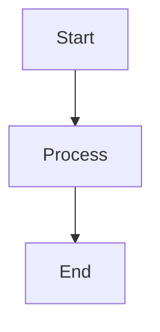

# R Commerce Documentation Website

A beautiful, fast, and searchable documentation website for the R Commerce headless e-commerce platform.


## 🚀 Features

- **Beautiful Design** - Material Design with dark/light mode
- **Fast Search** - Instant full-text search across all docs
- **Mobile Responsive** - Looks great on all devices
- **Versioning Support** - Multiple documentation versions
- **Mermaid Diagrams** - Visual architecture diagrams
- **Code Highlighting** - Syntax highlighting for all languages
- **SEO Optimized** - Meta tags, sitemap, structured data

## 📦 Prerequisites

- Python 3.8+
- pip

## 🛠️ Installation

### Option 1: Using pip

```bash
# Clone the repository
git clone https://gitee.com/captainjez/gocart.git
cd gocart/docs-website

# Install dependencies
pip install -r requirements.txt
```

### Option 2: Using virtual environment (Recommended)

```bash
cd gocart/docs-website

# Create virtual environment
python3 -m venv venv

# Activate
source venv/bin/activate  # On Windows: venv\Scripts\activate

# Install dependencies
pip install -r requirements.txt
```

## 💻 Development

### Serve Locally

```bash
# Start development server
mkdocs serve

# Or with specific host/port
mkdocs serve --dev-addr=0.0.0.0:8000
```

The site will be available at: http://127.0.0.1:8000

Hot reload is enabled - changes to markdown files will automatically refresh the browser.

### Build for Production

```bash
# Build the site
mkdocs build

# Or use the build script
chmod +x build.sh
./build.sh
```

The built site will be in the `site/` directory.

## 📁 Project Structure

```
docs-website/
├── README.md              # This file
├── mkdocs.yml            # Site configuration
├── requirements.txt      # Python dependencies
├── build.sh              # Build script
├── netlify.toml          # Netlify deployment config
├── vercel.json           # Vercel deployment config
├── DEPLOYMENT.md         # Detailed deployment guide
├── .github/
│   └── workflows/
│       └── deploy.yml    # GitHub Actions workflow
├── docs/                 # Documentation source
│   ├── index.md         # Home page
│   ├── assets/          # Images, logos, etc.
│   ├── stylesheets/     # Custom CSS
│   ├── javascripts/     # Custom JavaScript
│   └── includes/        # Shared includes
│   ├── architecture/    # → ../../docs/architecture
│   ├── api/             # → ../../docs/api
│   ├── deployment/      # → ../../docs/deployment
│   ├── development/     # → ../../docs/development
│   ├── migration-guides/# → ../../docs/migration-guides
│   └── features/        # → ../../docs/features
└── site/                # Build output (generated)
```

## 🎨 Customization

### Colors

Edit `docs/stylesheets/extra.css`:

```css
:root {
  --rcommerce-primary: #6366f1;
  --rcommerce-secondary: #8b5cf6;
  --rcommerce-accent: #ec4899;
}
```

### Logo

Replace `docs/assets/logo.svg` and `docs/assets/favicon.svg` with your own.

### Navigation

Edit `mkdocs.yml`:

```yaml
nav:
  - Home: index.md
  - Architecture:
    - Overview: architecture/01-overview.md
    # ...
```

## 🚀 Deployment

See [DEPLOYMENT.md](DEPLOYMENT.md) for detailed instructions.

### Quick Deploy

**GitHub Pages:**
```bash
# Automatically deployed on push to main branch
```

**Netlify:**
```bash
npm install -g netlify-cli
netlify deploy --prod --dir=site
```

**Vercel:**
```bash
npm install -g vercel
vercel --prod
```

## 🔧 Configuration

### Site Metadata

Edit in `mkdocs.yml`:

```yaml
site_name: R Commerce
site_description: High-Performance Headless E-Commerce Platform
site_url: https://rcommerce.app
```

### Analytics

Add to `mkdocs.yml`:

```yaml
extra:
  analytics:
    provider: google
    property: G-XXXXXXXXXX
```

### Social Links

```yaml
extra:
  social:
    - icon: fontawesome/brands/github
      link: https://gitee.com/captainjez/gocart
```

## 📝 Writing Documentation

### Markdown Extensions

The site supports many Markdown extensions:

**Admonitions:**
```markdown
!!! note "Title"
    This is a note.

!!! warning "Warning"
    This is a warning.
```

**Code Blocks:**
```markdown
```rust
fn main() {
    println!("Hello, R Commerce!");
}
```
```

**Tabs:**
```markdown
=== "Linux"
    ```bash
    cargo build --release
    ```

=== "macOS"
    ```bash
    cargo build --release
    ```
```

**Mermaid Diagrams:**
```markdown

```

### Abbreviations

Add abbreviations to `docs/includes/abbreviations.md`:

```markdown
*[API]: Application Programming Interface
*[REST]: Representational State Transfer
```

They will be automatically expanded throughout the documentation.

## 🔍 Search

The built-in search indexes:
- Page titles and content
- Headers
- Code blocks
- Navigation titles

Search is available in the top navigation bar (or press `Ctrl+K` / `Cmd+K`).

## 📱 Mobile Support

The documentation is fully responsive:
- Collapsible navigation on mobile
- Touch-friendly interface
- Optimized font sizes
- Mobile search

## 🌙 Dark Mode

Toggle between light and dark mode using the icon in the header. User preference is saved automatically.

## 🐛 Troubleshooting

### Build Errors

```bash
# Clean build
rm -rf site/
mkdocs build --clean

# Verbose output
mkdocs build -v
```

### Import Errors

```bash
# Reinstall dependencies
pip install -r requirements.txt --force-reinstall
```

### Changes Not Visible

1. Check browser console for errors
2. Hard refresh: `Ctrl+Shift+R` (or `Cmd+Shift+R` on Mac)
3. Clear site data in browser DevTools

## 📚 Resources

- [MkDocs Documentation](https://www.mkdocs.org/)
- [Material for MkDocs](https://squidfunk.github.io/mkdocs-material/)
- [PyMdown Extensions](https://facelessuser.github.io/pymdown-extensions/)
- [Mermaid Documentation](https://mermaid-js.github.io/)

## 🤝 Contributing

1. Fork the repository
2. Create a feature branch
3. Make your changes
4. Test locally with `mkdocs serve`
5. Submit a pull request

## 📄 License

MIT License - see the main repository for details.

---

Built with [MkDocs](https://www.mkdocs.org/) and [Material for MkDocs](https://squidfunk.github.io/mkdocs-material/)
