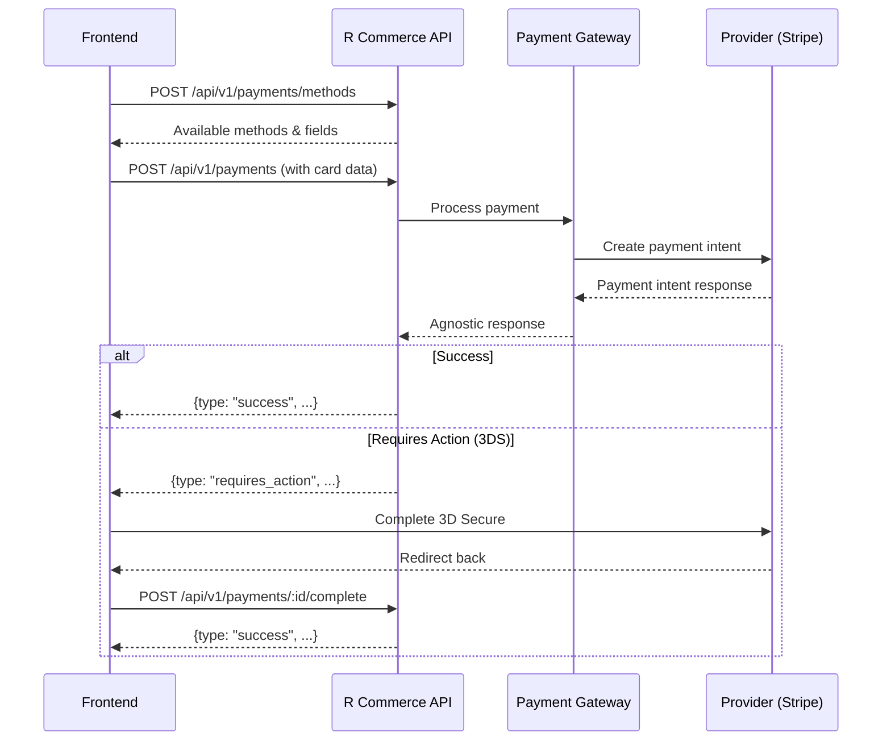

# Payments API

The Payments API handles payment processing through a provider-agnostic interface. All payment processing happens server-side for improved security and unified integration across all payment gateways.

## Overview

The Payments API provides a unified interface for processing payments through multiple gateways (Stripe, Airwallex, WeChat Pay, Alipay) without requiring frontend integration with provider SDKs.

**Key Benefits:**
- **Server-side processing**: Card data is sent to R Commerce API, not directly to providers
- **No provider SDKs required**: Frontend doesn't need Stripe.js or other SDKs
- **Unified interface**: Same API structure works for all gateways
- **Better security**: API keys are never exposed in frontend JavaScript

## Base URL

```
/api/v1/payments
```

## Authentication

Payment endpoints require secret API key for processing. Read-only access available with restricted keys.

```http
Authorization: Bearer YOUR_SECRET_KEY
```

## Payment Flow



## Endpoints

### Get Payment Methods

Retrieve available payment methods for a checkout session.

```http
POST /api/v1/payments/methods
Content-Type: application/json
Authorization: Bearer <token>
```

#### Request Body

```json
{
  "currency": "USD",
  "amount": "99.99"
}
```

#### Response

```json
[
  {
    "gateway_id": "stripe",
    "gateway_name": "Stripe",
    "payment_methods": [
      {
        "method_type": "card",
        "enabled": true,
        "display_name": "Credit/Debit Card",
        "requires_redirect": false,
        "supports_3ds": true,
        "supports_tokenization": true,
        "supports_recurring": true,
        "required_fields": [
          {
            "name": "number",
            "label": "Card Number",
            "field_type": "card_number",
            "required": true,
            "pattern": "^[\\d\\s]{13,19}$",
            "placeholder": "1234 5678 9012 3456"
          },
          {
            "name": "exp_month",
            "label": "Expiry Month",
            "field_type": "expiry_date",
            "required": true,
            "pattern": "^(0[1-9]|1[0-2])$",
            "placeholder": "MM"
          },
          {
            "name": "exp_year",
            "label": "Expiry Year",
            "field_type": "expiry_date",
            "required": true,
            "pattern": "^20[2-9][0-9]$",
            "placeholder": "YYYY"
          },
          {
            "name": "cvc",
            "label": "CVC",
            "field_type": "cvc",
            "required": true,
            "pattern": "^\\d{3,4}$",
            "placeholder": "123"
          }
        ],
        "supported_currencies": ["USD", "EUR", "GBP"],
        "min_amount": "0.50",
        "max_amount": "999999.99"
      }
    ]
  }
]
```

### Initiate Payment

Create a new payment. The payment is processed server-side by R Commerce.

```http
POST /api/v1/payments
Content-Type: application/json
Authorization: Bearer <token>
```

#### Request Body

```json
{
  "gateway_id": "stripe",
  "amount": "99.99",
  "currency": "USD",
  "payment_method": {
    "type": "card",
    "card": {
      "number": "4242424242424242",
      "exp_month": 12,
      "exp_year": 2025,
      "cvc": "123",
      "name": "John Doe"
    }
  },
  "order_id": "550e8400-e29b-41d4-a716-446655440100",
  "customer_email": "customer@example.com",
  "customer_id": "550e8400-e29b-41d4-a716-446655440001",
  "description": "Order #1001",
  "metadata": {
    "order_number": "1001"
  },
  "return_url": "https://yoursite.com/checkout/complete",
  "idempotency_key": "unique-key-123",
  "save_payment_method": false
}
```

#### Payment Method Types

**Card:**
```json
{
  "type": "card",
  "card": {
    "number": "4242424242424242",
    "exp_month": 12,
    "exp_year": 2025,
    "cvc": "123",
    "name": "John Doe"
  }
}
```

**Saved Card:**
```json
{
  "type": "saved_card",
  "token": "card_1234567890"
}
```

**Bank Transfer:**
```json
{
  "type": "bank_transfer",
  "bank_transfer": {
    "account_number": "000123456789",
    "routing_number": "110000000",
    "account_holder_name": "John Doe",
    "bank_name": "Test Bank"
  }
}
```

#### Response: Success

```json
{
  "type": "success",
  "payment_id": "pay_550e8400-e29b-41d4-a716-446655440000",
  "transaction_id": "pi_3O...",
  "payment_status": "succeeded",
  "payment_method": {
    "method_type": "card",
    "last_four": "4242",
    "card_brand": "visa",
    "exp_month": "12",
    "exp_year": "2025",
    "cardholder_name": "John Doe",
    "token": null
  },
  "receipt_url": "https://pay.stripe.com/receipts/..."
}
```

#### Response: Requires Action (3D Secure)

```json
{
  "type": "requires_action",
  "payment_id": "pay_550e8400-e29b-41d4-a716-446655440000",
  "action_type": "three_d_secure",
  "action_data": {
    "type": "use_stripe_sdk",
    "stripe_js": {
      "type": "three_d_secure_redirect",
      "stripe_js": "..."
    },
    "redirect_url": "https://hooks.stripe.com/3d_secure/..."
  },
  "expires_at": "2026-01-28T11:00:00Z"
}
```

#### Response: Failed

```json
{
  "type": "failed",
  "payment_id": "pay_550e8400-e29b-41d4-a716-446655440000",
  "error_code": "card_declined",
  "error_message": "Your card was declined.",
  "retry_allowed": true
}
```

### Complete Payment Action

Complete a payment that requires additional action (3D Secure, redirect, etc.).

```http
POST /api/v1/payments/{payment_id}/complete
Content-Type: application/json
Authorization: Bearer <token>
```

#### Request Body

```json
{
  "action_type": "three_d_secure",
  "action_data": {
    "payment_intent": "pi_3O...",
    "payment_intent_client_secret": "pi_3O..._secret_..."
  }
}
```

#### Response

```json
{
  "type": "success",
  "payment_id": "pay_550e8400-e29b-41d4-a716-446655440000",
  "transaction_id": "pi_3O...",
  "payment_status": "succeeded",
  "payment_method": {
    "method_type": "card",
    "last_four": "4242",
    "card_brand": "visa",
    "exp_month": "12",
    "exp_year": "2025"
  },
  "receipt_url": "https://pay.stripe.com/receipts/..."
}
```

### Get Payment Status

Retrieve the current status of a payment.

```http
GET /api/v1/payments/{payment_id}
Authorization: Bearer <token>
```

#### Response

```json
{
  "payment_id": "pay_550e8400-e29b-41d4-a716-446655440000",
  "status": "succeeded",
  "amount": "99.99",
  "currency": "USD",
  "gateway": "stripe",
  "transaction_id": "pi_3O...",
  "payment_method": {
    "method_type": "card",
    "last_four": "4242",
    "card_brand": "visa"
  },
  "created_at": "2026-01-28T10:00:00Z",
  "completed_at": "2026-01-28T10:00:05Z"
}
```

### Refund Payment

Refund a captured payment.

```http
POST /api/v1/payments/{payment_id}/refund
Content-Type: application/json
Authorization: Bearer <token>
```

#### Request Body

```json
{
  "amount": "99.99",
  "reason": "requested_by_customer",
  "metadata": {
    "note": "Customer unhappy with product"
  }
}
```

#### Refund Reasons

- `duplicate` - Duplicate charge
- `fraudulent` - Fraudulent transaction
- `requested_by_customer` - Customer request

#### Response

```json
{
  "refund_id": "ref_550e8400-e29b-41d4-a716-446655440001",
  "payment_id": "pay_550e8400-e29b-41d4-a716-446655440000",
  "amount": "99.99",
  "currency": "USD",
  "status": "succeeded",
  "reason": "requested_by_customer",
  "created_at": "2026-01-28T10:30:00Z"
}
```

## Payment Methods

### Save Payment Method

Save a payment method for future use.

```http
POST /api/v2/payment-methods
Content-Type: application/json
Authorization: Bearer <token>
```

#### Request Body

```json
{
  "gateway_id": "stripe",
  "payment_method_data": {
    "type": "card",
    "card": {
      "number": "4242424242424242",
      "exp_month": 12,
      "exp_year": 2025,
      "cvc": "123",
      "name": "John Doe"
    }
  },
  "set_as_default": true
}
```

#### Response

```json
{
  "token": "pm_550e8400-e29b-41d4-a716-446655440002",
  "payment_method": {
    "method_type": "card",
    "last_four": "4242",
    "card_brand": "visa",
    "exp_month": "12",
    "exp_year": "2025",
    "cardholder_name": "John Doe"
  },
  "expires_at": null
}
```

### List Saved Payment Methods

Retrieve saved payment methods for a customer.

```http
GET /api/v2/customers/{customer_id}/payment-methods
Authorization: Bearer <token>
```

#### Response

```json
[
  {
    "token": "pm_550e8400-e29b-41d4-a716-446655440002",
    "method_type": "card",
    "last_four": "4242",
    "card_brand": "visa",
    "exp_month": "12",
    "exp_year": "2025",
    "cardholder_name": "John Doe",
    "is_default": true
  }
]
```

### Delete Payment Method

Delete a saved payment method.

```http
DELETE /api/v2/payment-methods/{token}
Authorization: Bearer <token>
```

#### Response

```json
{
  "success": true,
  "message": "Payment method deleted",
  "token": "pm_550e8400-e29b-41d4-a716-446655440002"
}
```

## Webhooks

### Receive Provider Webhook

Receive webhooks from payment providers (Stripe, Airwallex, etc.).

```http
POST /api/v2/webhooks/{gateway_id}
Content-Type: application/json
```

#### Headers

Provider-specific headers (e.g., `Stripe-Signature`, `Airwallex-Signature`)

#### Response

```json
{
  "success": true,
  "gateway": "stripe",
  "message": "Webhook processed"
}
```

## Frontend Integration Example

```javascript
// checkout.js

async function processPayment() {
  // 1. Collect card data from form
  const cardData = {
    number: document.getElementById('cardNumber').value,
    exp_month: parseInt(document.getElementById('expMonth').value),
    exp_year: parseInt(document.getElementById('expYear').value),
    cvc: document.getElementById('cvc').value,
    name: document.getElementById('cardName').value
  };
  
  // 2. Send to R Commerce API
  const response = await fetch('/api/v1/payments', {
    method: 'POST',
    headers: {
      'Content-Type': 'application/json',
      'Authorization': `Bearer ${API_KEY}`
    },
    body: JSON.stringify({
      gateway_id: 'stripe', // or 'airwallex', 'wechatpay', etc.
      amount: '99.99',
      currency: 'USD',
      payment_method: {
        type: 'card',
        card: cardData
      },
      order_id: orderId,
      customer_email: customerEmail,
      return_url: window.location.origin + '/checkout/complete'
    })
  });
  
  const result = await response.json();
  
  // 3. Handle response
  switch (result.type) {
    case 'success':
      // Payment complete
      window.location.href = '/checkout/success';
      break;
      
    case 'requires_action':
      // Handle 3D Secure or redirect
      if (result.action_type === 'redirect') {
        window.location.href = result.action_data.redirect_url;
      } else if (result.action_type === 'three_d_secure') {
        await handleThreeDSecure(result);
      }
      break;
      
    case 'failed':
      showError(result.error_message);
      break;
  }
}

// Handle 3D Secure completion
async function handleThreeDSecure(paymentResult) {
  // Option 1: Redirect approach
  window.location.href = paymentResult.action_data.redirect_url;
}

// Called when customer returns from 3DS/redirect
async function completePayment(paymentId) {
  const response = await fetch(`/api/v1/payments/${paymentId}/complete`, {
    method: 'POST',
    headers: {
      'Content-Type': 'application/json',
      'Authorization': `Bearer ${API_KEY}`
    },
    body: JSON.stringify({
      action_type: 'three_d_secure',
      action_data: {
        // Data from URL params or iframe
      }
    })
  });
  
  const result = await response.json();
  
  if (result.type === 'success') {
    window.location.href = '/checkout/success';
  } else {
    showError(result.error_message);
  }
}
```

## Error Codes

| Code | HTTP Status | Description |
|------|-------------|-------------|
| `PAYMENT_NOT_FOUND` | 404 | Payment does not exist |
| `INVALID_AMOUNT` | 400 | Invalid payment amount |
| `INVALID_CURRENCY` | 400 | Unsupported currency |
| `INVALID_PAYMENT_METHOD` | 400 | Invalid card or bank details |
| `CARD_DECLINED` | 402 | Card was declined |
| `INSUFFICIENT_FUNDS` | 402 | Card has insufficient funds |
| `EXPIRED_CARD` | 402 | Card has expired |
| `INCORRECT_CVC` | 402 | CVC check failed |
| `PROCESSING_ERROR` | 402 | Gateway processing error |
| `ALREADY_CAPTURED` | 409 | Payment already captured |
| `ALREADY_REFUNDED` | 409 | Payment already fully refunded |
| `REFUND_AMOUNT_INVALID` | 400 | Refund exceeds payment amount |
| `GATEWAY_NOT_FOUND` | 404 | Payment gateway not configured |
| `IDEMPOTENCY_KEY_REUSED` | 409 | Idempotency key already used |

## Webhook Events

| Event | Description |
|-------|-------------|
| `payment.created` | New payment initiated |
| `payment.succeeded` | Payment completed successfully |
| `payment.failed` | Payment failed |
| `payment.captured` | Authorized payment captured |
| `payment.canceled` | Payment canceled |
| `payment.requires_action` | Payment requires 3D Secure or redirect |
| `payment.action_completed` | 3D Secure or redirect completed |
| `refund.created` | Refund initiated |
| `refund.succeeded` | Refund completed |
| `refund.failed` | Refund failed |

## Migration from v1 API

### v1 (Legacy) - Required Stripe.js

```javascript
import { loadStripe } from '@stripe/stripe-js';

const stripe = await loadStripe('pk_live_...');
const { client_secret } = await fetch('/api/v1/payments').then(r => r.json());
const result = await stripe.confirmCardPayment(client_secret, { ... });
```

### v2 (New) - Server-Side Processing

```javascript
const result = await fetch('/api/v1/payments', {
  method: 'POST',
  body: JSON.stringify({
    gateway_id: 'stripe',
    payment_method: { type: 'card', card: { number, exp_month, ... } }
  })
});
// Handle RequiresAction or Success response
```

## Test Cards

### Stripe Test Cards

| Card Number | Scenario |
|-------------|----------|
| `4242424242424242` | Success |
| `4000000000000002` | Declined |
| `4000000000009995` | Insufficient funds |
| `4000002500003155` | Requires 3D Secure |
| `4000000000003220` | 3D Secure 2 frictionless |
| `4000008400001629` | 3D Secure 2 challenge |
| `4000000000000127` | Incorrect CVC |
| `4000000000000069` | Expired card |
