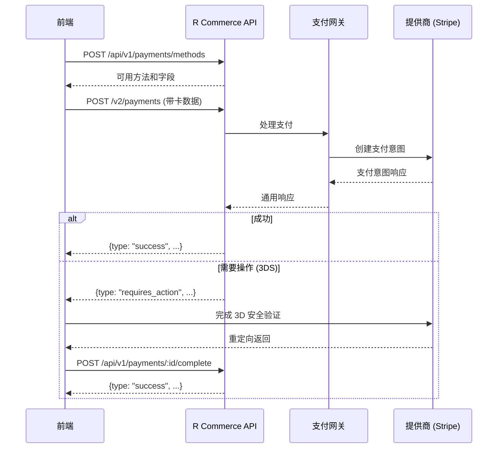

# 支付 API

支付 API 通过提供商无关的接口处理支付。所有支付处理都在服务器端进行，以提高安全性并实现所有支付网关的统一集成。所有端点均已完全实现并正常运行。

## 概述

支付 API 提供了一个统一的接口，用于通过多个网关（Stripe、Airwallex、微信支付、支付宝）处理支付，无需前端与提供商 SDK 集成。

**主要优势：**
- **服务器端处理**：卡数据发送到 R Commerce API，而不是直接发送给提供商
- **无需提供商 SDK**：前端不需要 Stripe.js 或其他 SDK
- **统一接口**：相同的 API 结构适用于所有网关
- **更好的安全性**：API 密钥永远不会暴露在前端 JavaScript 中

## 基础 URL

```
/api/v1/payments
```

## 认证

支付端点需要密钥进行支付处理。只读访问可使用受限密钥。

```http
Authorization: Bearer YOUR_SECRET_KEY
```

## 支付流程



## 端点

### 获取支付方式

检索结账会话的可用支付方式。

```http
POST /api/v1/payments/methods
Content-Type: application/json
Authorization: Bearer <token>
```

#### 请求体

```json
{
  "currency": "USD",
  "amount": "99.99"
}
```

#### 响应

```json
[
  {
    "gateway_id": "stripe",
    "gateway_name": "Stripe",
    "payment_methods": [
      {
        "method_type": "card",
        "enabled": true,
        "display_name": "信用卡/借记卡",
        "requires_redirect": false,
        "supports_3ds": true,
        "supports_tokenization": true,
        "supports_recurring": true,
        "required_fields": [
          {
            "name": "number",
            "label": "卡号",
            "field_type": "card_number",
            "required": true,
            "pattern": "^[\\d\\s]{13,19}$",
            "placeholder": "1234 5678 9012 3456"
          },
          {
            "name": "exp_month",
            "label": "到期月份",
            "field_type": "expiry_date",
            "required": true,
            "pattern": "^(0[1-9]|1[0-2])$",
            "placeholder": "MM"
          },
          {
            "name": "exp_year",
            "label": "到期年份",
            "field_type": "expiry_date",
            "required": true,
            "pattern": "^20[2-9][0-9]$",
            "placeholder": "YYYY"
          },
          {
            "name": "cvc",
            "label": "安全码",
            "field_type": "cvc",
            "required": true,
            "pattern": "^\\d{3,4}$",
            "placeholder": "123"
          }
        ],
        "supported_currencies": ["USD", "EUR", "GBP"],
        "min_amount": "0.50",
        "max_amount": "999999.99"
      }
    ]
  }
]
```

### 发起支付

创建新支付。支付由 R Commerce 在服务器端处理。

```http
POST /api/v1/payments
Content-Type: application/json
Authorization: Bearer <token>
```

#### 请求体

```json
{
  "gateway_id": "stripe",
  "amount": "99.99",
  "currency": "USD",
  "payment_method": {
    "type": "card",
    "card": {
      "number": "4242424242424242",
      "exp_month": 12,
      "exp_year": 2025,
      "cvc": "123",
      "name": "John Doe"
    }
  },
  "order_id": "550e8400-e29b-41d4-a716-446655440100",
  "customer_email": "customer@example.com",
  "customer_id": "550e8400-e29b-41d4-a716-446655440001",
  "description": "订单 #1001",
  "metadata": {
    "order_number": "1001"
  },
  "return_url": "https://yoursite.com/checkout/complete",
  "idempotency_key": "unique-key-123",
  "save_payment_method": false
}
```

#### 支付方式类型

**卡：**
```json
{
  "type": "card",
  "card": {
    "number": "4242424242424242",
    "exp_month": 12,
    "exp_year": 2025,
    "cvc": "123",
    "name": "John Doe"
  }
}
```

**已保存的卡：**
```json
{
  "type": "saved_card",
  "token": "card_1234567890"
}
```

**银行转账：**
```json
{
  "type": "bank_transfer",
  "bank_transfer": {
    "account_number": "000123456789",
    "routing_number": "110000000",
    "account_holder_name": "John Doe",
    "bank_name": "测试银行"
  }
}
```

#### 响应：成功

```json
{
  "type": "success",
  "payment_id": "pay_550e8400-e29b-41d4-a716-446655440000",
  "transaction_id": "pi_3O...",
  "payment_status": "succeeded",
  "payment_method": {
    "method_type": "card",
    "last_four": "4242",
    "card_brand": "visa",
    "exp_month": "12",
    "exp_year": "2025",
    "cardholder_name": "John Doe",
    "token": null
  },
  "receipt_url": "https://pay.stripe.com/receipts/..."
}
```

#### 响应：需要操作 (3D 安全验证)

```json
{
  "type": "requires_action",
  "payment_id": "pay_550e8400-e29b-41d4-a716-446655440000",
  "action_type": "three_d_secure",
  "action_data": {
    "type": "use_stripe_sdk",
    "stripe_js": {
      "type": "three_d_secure_redirect",
      "stripe_js": "..."
    },
    "redirect_url": "https://hooks.stripe.com/3d_secure/..."
  },
  "expires_at": "2026-01-28T11:00:00Z"
}
```

#### 响应：失败

```json
{
  "type": "failed",
  "payment_id": "pay_550e8400-e29b-41d4-a716-446655440000",
  "error_code": "card_declined",
  "error_message": "您的卡被拒绝。",
  "retry_allowed": true
}
```

### 完成支付操作

完成需要额外操作的支付（3D 安全验证、重定向等）。

```http
POST /api/v1/payments/{payment_id}/complete
Content-Type: application/json
Authorization: Bearer <token>
```

#### 请求体

```json
{
  "action_type": "three_d_secure",
  "action_data": {
    "payment_intent": "pi_3O...",
    "payment_intent_client_secret": "pi_3O..._secret_..."
  }
}
```

#### 响应

```json
{
  "type": "success",
  "payment_id": "pay_550e8400-e29b-41d4-a716-446655440000",
  "transaction_id": "pi_3O...",
  "payment_status": "succeeded",
  "payment_method": {
    "method_type": "card",
    "last_four": "4242",
    "card_brand": "visa",
    "exp_month": "12",
    "exp_year": "2025"
  },
  "receipt_url": "https://pay.stripe.com/receipts/..."
}
```

### 获取支付状态

检索支付的当前状态。

```http
GET /api/v1/payments/{payment_id}
Authorization: Bearer <token>
```

#### 响应

```json
{
  "payment_id": "pay_550e8400-e29b-41d4-a716-446655440000",
  "status": "succeeded",
  "amount": "99.99",
  "currency": "USD",
  "gateway": "stripe",
  "transaction_id": "pi_3O...",
  "payment_method": {
    "method_type": "card",
    "last_four": "4242",
    "card_brand": "visa"
  },
  "created_at": "2026-01-28T10:00:00Z",
  "completed_at": "2026-01-28T10:00:05Z"
}
```

### 退款

对已捕获的支付进行退款。

```http
POST /api/v1/payments/{payment_id}/refund
Content-Type: application/json
Authorization: Bearer <token>
```

#### 请求体

```json
{
  "amount": "99.99",
  "reason": "requested_by_customer",
  "metadata": {
    "note": "客户对产品不满意"
  }
}
```

#### 退款原因

- `duplicate` - 重复扣款
- `fraudulent` - 欺诈交易
- `requested_by_customer` - 客户要求

#### 响应

```json
{
  "refund_id": "ref_550e8400-e29b-41d4-a716-446655440001",
  "payment_id": "pay_550e8400-e29b-41d4-a716-446655440000",
  "amount": "99.99",
  "currency": "USD",
  "status": "succeeded",
  "reason": "requested_by_customer",
  "created_at": "2026-01-28T10:30:00Z"
}
```

## 支付方式

### 保存支付方式

保存支付方式以供将来使用。

```http
POST /api/v2/payment-methods
Content-Type: application/json
Authorization: Bearer <token>
```

#### 请求体

```json
{
  "gateway_id": "stripe",
  "payment_method_data": {
    "type": "card",
    "card": {
      "number": "4242424242424242",
      "exp_month": 12,
      "exp_year": 2025,
      "cvc": "123",
      "name": "John Doe"
    }
  },
  "set_as_default": true
}
```

#### 响应

```json
{
  "token": "pm_550e8400-e29b-41d4-a716-446655440002",
  "payment_method": {
    "method_type": "card",
    "last_four": "4242",
    "card_brand": "visa",
    "exp_month": "12",
    "exp_year": "2025",
    "cardholder_name": "John Doe"
  },
  "expires_at": null
}
```

### 列出已保存的支付方式

检索客户已保存的支付方式。

```http
GET /api/v2/customers/{customer_id}/payment-methods
Authorization: Bearer <token>
```

#### 响应

```json
[
  {
    "token": "pm_550e8400-e29b-41d4-a716-446655440002",
    "method_type": "card",
    "last_four": "4242",
    "card_brand": "visa",
    "exp_month": "12",
    "exp_year": "2025",
    "cardholder_name": "John Doe",
    "is_default": true
  }
]
```

### 删除支付方式

删除已保存的支付方式。

```http
DELETE /api/v2/payment-methods/{token}
Authorization: Bearer <token>
```

#### 响应

```json
{
  "success": true,
  "message": "支付方式已删除",
  "token": "pm_550e8400-e29b-41d4-a716-446655440002"
}
```

## Webhooks

### 接收提供商 Webhook

接收来自支付提供商（Stripe、Airwallex 等）的 webhook。

```http
POST /api/v2/webhooks/{gateway_id}
Content-Type: application/json
```

#### 请求头

提供商特定的请求头（例如 `Stripe-Signature`、`Airwallex-Signature`）

#### 响应

```json
{
  "success": true,
  "gateway": "stripe",
  "message": "Webhook 已处理"
}
```

## 前端集成示例

```javascript
// checkout.js

async function processPayment() {
  // 1. 从表单收集卡数据
  const cardData = {
    number: document.getElementById('cardNumber').value,
    exp_month: parseInt(document.getElementById('expMonth').value),
    exp_year: parseInt(document.getElementById('expYear').value),
    cvc: document.getElementById('cvc').value,
    name: document.getElementById('cardName').value
  };
  
  // 2. 发送到 R Commerce API
  const response = await fetch('/api/v1/payments', {
    method: 'POST',
    headers: {
      'Content-Type': 'application/json',
      'Authorization': `Bearer ${API_KEY}`
    },
    body: JSON.stringify({
      gateway_id: 'stripe', // 或 'airwallex'、'wechatpay' 等
      amount: '99.99',
      currency: 'USD',
      payment_method: {
        type: 'card',
        card: cardData
      },
      order_id: orderId,
      customer_email: customerEmail,
      return_url: window.location.origin + '/checkout/complete'
    })
  });
  
  const result = await response.json();
  
  // 3. 处理响应
  switch (result.type) {
    case 'success':
      // 支付完成
      window.location.href = '/checkout/success';
      break;
      
    case 'requires_action':
      // 处理 3D 安全验证或重定向
      if (result.action_type === 'redirect') {
        window.location.href = result.action_data.redirect_url;
      } else if (result.action_type === 'three_d_secure') {
        await handleThreeDSecure(result);
      }
      break;
      
    case 'failed':
      showError(result.error_message);
      break;
  }
}

// 处理 3D 安全验证完成
async function handleThreeDSecure(paymentResult) {
  // 选项 1：重定向方式
  window.location.href = paymentResult.action_data.redirect_url;
}

// 客户从 3DS/重定向返回时调用
async function completePayment(paymentId) {
  const response = await fetch(`/api/v1/payments/${paymentId}/complete`, {
    method: 'POST',
    headers: {
      'Content-Type': 'application/json',
      'Authorization': `Bearer ${API_KEY}`
    },
    body: JSON.stringify({
      action_type: 'three_d_secure',
      action_data: {
        // 来自 URL 参数或 iframe 的数据
      }
    })
  });
  
  const result = await response.json();
  
  if (result.type === 'success') {
    window.location.href = '/checkout/success';
  } else {
    showError(result.error_message);
  }
}
```

## 错误代码

| 代码 | HTTP 状态 | 说明 |
|------|-------------|-------------|
| `PAYMENT_NOT_FOUND` | 404 | 支付不存在 |
| `INVALID_AMOUNT` | 400 | 支付金额无效 |
| `INVALID_CURRENCY` | 400 | 不支持的货币 |
| `INVALID_PAYMENT_METHOD` | 400 | 卡或银行信息无效 |
| `CARD_DECLINED` | 402 | 卡被拒绝 |
| `INSUFFICIENT_FUNDS` | 402 | 卡余额不足 |
| `EXPIRED_CARD` | 402 | 卡已过期 |
| `INCORRECT_CVC` | 402 | CVC 验证失败 |
| `PROCESSING_ERROR` | 402 | 网关处理错误 |
| `ALREADY_CAPTURED` | 409 | 支付已捕获 |
| `ALREADY_REFUNDED` | 409 | 支付已全额退款 |
| `REFUND_AMOUNT_INVALID` | 400 | 退款超过支付金额 |
| `GATEWAY_NOT_FOUND` | 404 | 支付网关未配置 |
| `IDEMPOTENCY_KEY_REUSED` | 409 | 幂等键已使用 |

## Webhook 事件

| 事件 | 说明 |
|-------|-------------|
| `payment.created` | 新支付已发起 |
| `payment.succeeded` | 支付成功完成 |
| `payment.failed` | 支付失败 |
| `payment.captured` | 已授权支付已捕获 |
| `payment.canceled` | 支付已取消 |
| `payment.requires_action` | 支付需要 3D 安全验证或重定向 |
| `payment.action_completed` | 3D 安全验证或重定向已完成 |
| `refund.created` | 退款已发起 |
| `refund.succeeded` | 退款已完成 |
| `refund.failed` | 退款失败 |

## 从 v1 API 迁移

### v1 (旧版) - 需要 Stripe.js

```javascript
import { loadStripe } from '@stripe/stripe-js';

const stripe = await loadStripe('pk_live_...');
const { client_secret } = await fetch('/api/v1/payments').then(r => r.json());
const result = await stripe.confirmCardPayment(client_secret, { ... });
```

### v2 (新版) - 服务器端处理

```javascript
const result = await fetch('/api/v1/payments', {
  method: 'POST',
  body: JSON.stringify({
    gateway_id: 'stripe',
    payment_method: { type: 'card', card: { number, exp_month, ... } }
  })
});
// 处理 RequiresAction 或 Success 响应
```

## 测试卡

### Stripe 测试卡

| 卡号 | 场景 |
|-------------|----------|
| `4242424242424242` | 成功 |
| `4000000000000002` | 拒绝 |
| `4000000000009995` | 余额不足 |
| `4000002500003155` | 需要 3D 安全验证 |
| `4000000000003220` | 3D 安全验证 2 无摩擦 |
| `4000008400001629` | 3D 安全验证 2 挑战 |
| `4000000000000127` | CVC 不正确 |
| `4000000000000069` | 卡已过期 |
