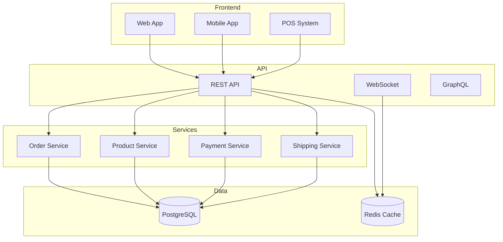

# R Commerce

<p style="font-size: 1.5rem; font-weight: 300; margin-top: -0.5em; color: var(--md-default-fg-color--light);">High-Performance Headless E-Commerce Platform</p>

---

## Why R Commerce?

<div class="grid" markdown>

<div markdown>

### Blazing Fast

Sub-10ms API responses with Rust's zero-cost abstractions. Handle 10,000+ concurrent users per instance.

</div>

<div markdown>

### Memory Safe

Rust's ownership model eliminates entire classes of bugs. No garbage collection pauses, no memory leaks.

</div>

<div markdown>

### Headless Architecture

API-first design powers any frontend. React, Vue, mobile apps, IoT devices - use what you love.

</div>

<div markdown>

### PostgreSQL Powered

Built on PostgreSQL for reliability, performance, and full ACID compliance.

</div>

<div markdown>

### 6 Payment Gateways

Stripe, PayPal, WeChat Pay, AliPay, Airwallex, Braintree included. Easy to add more.

</div>

<div markdown>

### Global Shipping

Multi-carrier support with real-time rates, label generation, and tracking integration.

</div>

</div>

---

## Architecture Overview



---

## Core Features

| Feature | Description | Status |
|---------|-------------|--------|
| **Product Management** | Simple, Variable, Subscription, Digital, Bundle products | Complete |
| **Order Management** | Full lifecycle with editing capabilities | Complete |
| **Payment Processing** | 6 gateways with fraud detection | Complete |
| **Shipping** | Multi-carrier with real-time rates | Complete |
| **Subscriptions** | Recurring billing with dunning management | Complete |
| **Notifications** | Email, SMS, Push, Webhooks | Complete |
| **Redis Caching** | Session, Rate Limit, Job Queue | Complete |
| **WebSocket** | Real-time updates and pub/sub | Complete |

---

## Quick Start

### Installation

```bash
# Clone the repository
git clone https://github.com/creativebastard/rcommerce.git
cd rcommerce

# Build the project
cargo build --release

# Run with default configuration
./target/release/rcommerce-server
```

### Docker Deployment

```bash
# Start with Docker Compose
docker-compose up -d

# Services available:
# - API: http://localhost:8080
# - Database: PostgreSQL on port 5432
# - Redis: port 6379
```

---

## Documentation

<div class="grid" markdown>

<div markdown>

### [Getting Started](getting-started/quickstart.md)

Quick start guide, installation instructions, and initial configuration.

</div>

<div markdown>

### [API Reference](api-reference/index.md)

Complete REST API documentation with examples and error codes.

</div>

<div markdown>

### [Payment Gateways](payment-gateways/index.md)

Configure Stripe, Airwallex, WeChat Pay, AliPay, and more.

</div>

<div markdown>

### [Deployment](deployment/index.md)

Production deployment guides for Docker, Kubernetes, and bare metal.

</div>

<div markdown>

### [Operations](deployment/index.md)

Scaling, monitoring, backups, reverse proxies, and security.

</div>

<div markdown>

### [Development](development/index.md)

Developer guide, CLI reference, and configuration options.

</div>

<div markdown>

### [Migration](migration/index.md)

Migrate from Shopify, WooCommerce, Magento, or Medusa.

</div>

<div markdown>

### [Architecture](architecture/overview.md)

Deep dive into system design, data models, and integration patterns.

</div>

</div>

---

## Example API Usage

### Create a Product

```bash
curl -X POST http://localhost:8080/api/v1/products \
  -H "Content-Type: application/json" \
  -H "Authorization: Bearer YOUR_API_KEY" \
  -d '{
    "title": "Premium Widget",
    "product_type": "simple",
    "price": 29.99,
    "inventory_quantity": 100
  }'
```

### Create an Order

```bash
curl -X POST http://localhost:8080/api/v1/orders \
  -H "Content-Type: application/json" \
  -H "Authorization: Bearer YOUR_API_KEY" \
  -d '{
    "customer_id": "uuid-here",
    "items": [{
      "product_id": "product-uuid",
      "quantity": 2
    }],
    "shipping_address": { ... }
  }'
```

---

## Supported Platforms

| Platform | Deployment Method |
|----------|-------------------|
| Linux | systemd, Docker, Kubernetes |
| macOS | launchd, Docker |
| FreeBSD | rc.d, iocage jails |
| Docker | Docker Compose, Swarm |
| Kubernetes | Helm charts, Operators |

---

## Performance Benchmarks

| Metric | Value |
|--------|-------|
| Binary Size | ~20 MB |
| Memory Usage | 10-50 MB |
| API Response Time | < 10ms avg |
| Concurrent Users | 10,000+ per instance |
| Cold Start | < 1 second |

---

## Roadmap

- [x] Phase 0: Project Foundation
- [x] Phase 1: Core Infrastructure
- [x] Phase 2: Order & Product System
- [x] Phase 3: Payment & Shipping
- [x] Phase 4: Real-time Features
- [ ] Phase 5: Advanced Features (In Progress)

---

<p style="text-align: center; padding: 2em 0;">
<a href="getting-started/quickstart.md" class="md-button md-button--primary">Get Started</a>
</p>

---

<p style="text-align: center; color: var(--md-default-fg-color--light);">
Built with care in Rust • Dual Licensed (AGPL-3.0 / Commercial) • 
<a href="https://github.com/creativebastard/rcommerce">GitHub</a>
</p>
