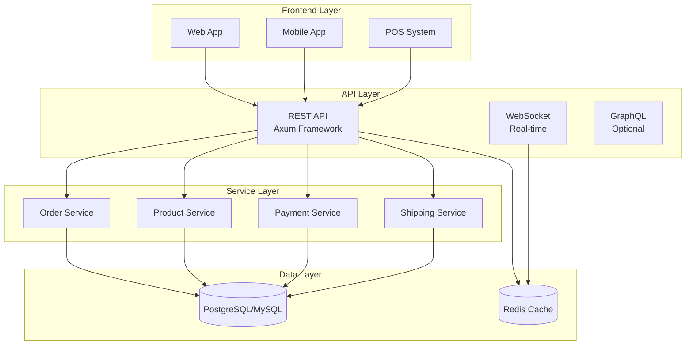

# R Commerce

<h2 style="font-weight: 300; margin-top: -0.5em;">High-Performance Headless E-Commerce Platform</h2>

<div style="text-align: center; padding: 2em 0;">
  
</div>

## 🚀 Why R Commerce?

<div class="grid cards" markdown>

- :material-rocket-launch:{ .lg .middle } __Blazing Fast__

  ---

  Sub-10ms API responses with Rust's zero-cost abstractions. Handle 10,000+ concurrent users per instance.

- :material-shield-check:{ .lg .middle } __Memory Safe__

  ---

  Rust's ownership model eliminates entire classes of bugs. No garbage collection pauses, no memory leaks.

- :material-code-json:{ .lg .middle } __Headless Architecture__

  ---

  API-first design powers any frontend. React, Vue, mobile apps, IoT devices - use what you love.

- :material-database:{ .lg .middle } __Multi-Database__

  ---

  PostgreSQL, MySQL, or SQLite. Choose the right database for each deployment scenario.

- :material-credit-card:{ .lg .middle } __6 Payment Gateways__

  ---

  Stripe, PayPal, WeChat Pay, AliPay, Airwallex, Braintree included. Easy to add more.

- :material-truck-delivery:{ .lg .middle } __Global Shipping__

  ---

  Multi-carrier support with real-time rates, label generation, and tracking integration.

</div>

## 🏗️ Architecture Overview



## ✨ Core Features

| Feature | Description | Status |
|---------|-------------|--------|
| **Product Management** | Simple, Variable, Subscription, Digital, Bundle products | ✅ Complete |
| **Order Management** | Full lifecycle with editing capabilities | ✅ Complete |
| **Payment Processing** | 6 gateways with fraud detection | ✅ Complete |
| **Shipping** | Multi-carrier with real-time rates | ✅ Complete |
| **Subscriptions** | Recurring billing with dunning management | ✅ Complete |
| **Notifications** | Email, SMS, Push, Webhooks | ✅ Complete |
| **Redis Caching** | Session, Rate Limit, Job Queue | ✅ Complete |
| **WebSocket** | Real-time updates and pub/sub | ✅ Complete |

## 🚀 Quick Start

### Installation

```bash
# Clone the repository
git clone https://gitee.com/captainjez/gocart.git
cd gocart

# Build the project
cargo build --release

# Run with default configuration
./target/release/rcommerce-server
```

### Docker Deployment

```bash
# Start with Docker Compose
docker-compose up -d

# Services available:
# - API: http://localhost:8080
# - Database: PostgreSQL on port 5432
# - Redis: port 6379
```

## 📚 Documentation

<div class="grid cards" markdown>

- :material-book-open-variant:{ .lg .middle } __Getting Started__

  ---

  Quick start guide, installation instructions, and initial configuration.

  [:octicons-arrow-right-24: Get Started](getting-started/quickstart.md)

- :material-api:{ .lg .middle } __API Reference__

  ---

  Complete REST API documentation with examples and error codes.

  [:octicons-arrow-right-24: View API](api-reference/index.md)

- :material-credit-card:{ .lg .middle } __Payment Gateways__

  ---

  Configure Stripe, Airwallex, WeChat Pay, AliPay, and more.

  [:octicons-arrow-right-24: Configure Payments](payment-gateways/index.md)

- :material-rocket-launch:{ .lg .middle } __Deployment__

  ---

  Production deployment guides for Docker, Kubernetes, and bare metal.

  [:octicons-arrow-right-24: Deploy](deployment/index.md)

- :material-server:{ .lg .middle } __Operations__

  ---

  Scaling, monitoring, backups, reverse proxies, and security.

  [:octicons-arrow-right-24: Operations](operations/index.md)

- :material-code-braces:{ .lg .middle } __Development__

  ---

  Developer guide, CLI reference, and configuration options.

  [:octicons-arrow-right-24: Develop](development/index.md)

- :material-swap-horizontal:{ .lg .middle } __Migration__

  ---

  Migrate from Shopify, WooCommerce, Magento, or Medusa.

  [:octicons-arrow-right-24: Migrate](migration/index.md)

- :material-architecture:{ .lg .middle } __Architecture__

  ---

  Deep dive into system design, data models, and integration patterns.

  [:octicons-arrow-right-24: Architecture](architecture/overview.md)

</div>

## 💡 Example API Usage

### Create a Product

```bash
curl -X POST http://localhost:8080/api/v1/products \
  -H "Content-Type: application/json" \
  -H "Authorization: Bearer YOUR_API_KEY" \
  -d '{
    "title": "Premium Widget",
    "product_type": "simple",
    "price": 29.99,
    "inventory_quantity": 100
  }'
```

### Create an Order

```bash
curl -X POST http://localhost:8080/api/v1/orders \
  -H "Content-Type: application/json" \
  -H "Authorization: Bearer YOUR_API_KEY" \
  -d '{
    "customer_id": "uuid-here",
    "items": [{
      "product_id": "product-uuid",
      "quantity": 2
    }],
    "shipping_address": { ... }
  }'
```

## 🖥️ Supported Platforms

<div style="display: flex; gap: 2em; justify-content: center; flex-wrap: wrap; padding: 2em 0;">

<span style="font-size: 2em;" title="Linux">🐧</span>
<span style="font-size: 2em;" title="macOS">🍎</span>
<span style="font-size: 2em;" title="FreeBSD">🦅</span>
<span style="font-size: 2em;" title="Docker">🐳</span>
<span style="font-size: 2em;" title="Kubernetes">☸️</span>

</div>

## 📊 Performance Benchmarks

| Metric | Value |
|--------|-------|
| Binary Size | ~20 MB |
| Memory Usage | 10-50 MB |
| API Response Time | < 10ms avg |
| Concurrent Users | 10,000+ per instance |
| Cold Start | < 1 second |

## 🗺️ Roadmap

- [x] Phase 0: Project Foundation
- [x] Phase 1: Core Infrastructure
- [x] Phase 2: Order & Product System
- [x] Phase 3: Payment & Shipping
- [x] Phase 4: Real-time Features
- [ ] Phase 5: Advanced Features (In Progress)

---

<div style="text-align: center; padding: 2em 0;">

**Ready to build?** [Get Started](getting-started/quickstart.md){ .md-button .md-button--primary }

</div>

---

<p style="text-align: center; color: var(--md-default-fg-color--light);">
Built with ❤️ in Rust • MIT License • 
<a href="https://gitee.com/captainjez/gocart">GitHub</a>
</p>
