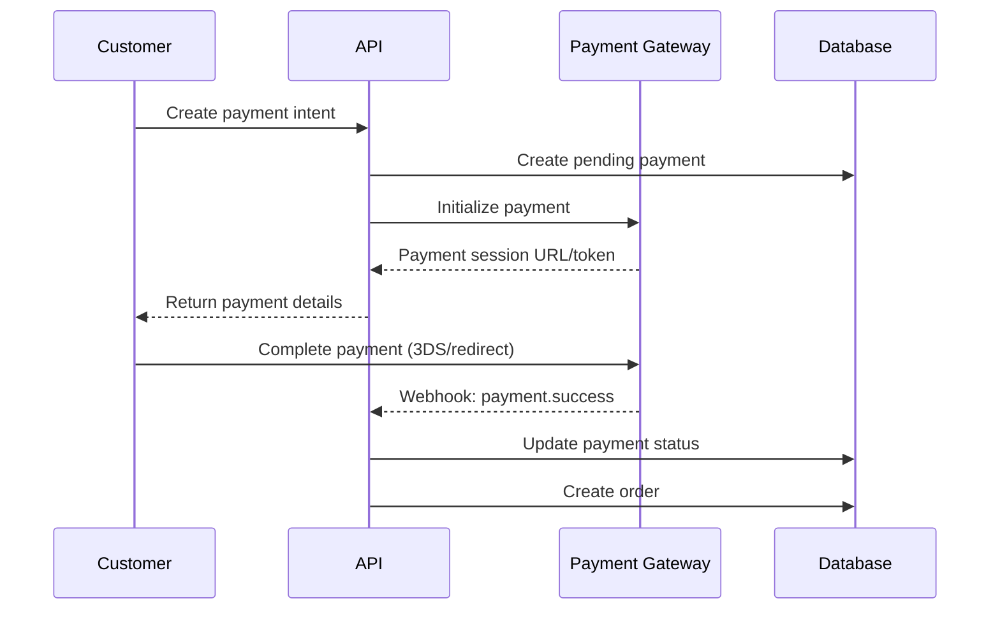

# Payment Gateways

R Commerce supports multiple payment gateways with a unified interface, allowing you to accept payments from customers worldwide.

## Supported Gateways

| Gateway | Region | Features |
|---------|--------|----------|
| [Stripe](./stripe.md) | Global | Cards, wallets, subscriptions |
| [Airwallex](./airwallex.md) | Global | Multi-currency, FX optimization |
| [Alipay](./alipay.md) | China | QR payments, mobile wallets |
| [WeChat Pay](./wechatpay.md) | China | In-app payments, mini programs |

## Architecture Overview

All payment gateways implement a common trait:

```rust
#[async_trait]
pub trait PaymentGateway: Send + Sync {
    async fn create_payment(
        &self,
        request: CreatePaymentRequest,
    ) -> Result<PaymentResponse, PaymentError>;
    
    async fn capture_payment(
        &self,
        payment_id: &str,
    ) -> Result<PaymentResponse, PaymentError>;
    
    async fn refund_payment(
        &self,
        payment_id: &str,
        amount: Option<Decimal>,
    ) -> Result<RefundResponse, PaymentError>;
    
    async fn verify_webhook(
        &self,
        headers: &HeaderMap,
        body: &[u8],
    ) -> Result<WebhookEvent, PaymentError>;
}
```

## Configuration

Enable payment gateways in your configuration:

```toml
[payment]
default_gateway = "stripe"

[payment.stripe]
enabled = true
api_key = "${STRIPE_API_KEY}"
webhook_secret = "${STRIPE_WEBHOOK_SECRET}"

[payment.airwallex]
enabled = true
api_key = "${AIRWALLEX_API_KEY}"
client_id = "${AIRWALLEX_CLIENT_ID}"
```

## Payment Flow



## Security

- All API keys stored as environment variables
- Webhook signatures verified for authenticity
- PCI compliance through tokenization (never store raw card data)
- Idempotency keys prevent duplicate charges

## Webhook Handling

Configure webhook endpoints in each gateway's dashboard:

```
https://your-api.com/api/v1/webhooks/payments/{gateway}
```

See [Webhooks](./webhooks.md) for event types and handling.

## Multi-Gateway Strategy

You can configure multiple gateways and route payments based on:

- **Currency**: Use Airwallex for multi-currency, Stripe for USD/EUR
- **Region**: Alipay/WeChat for China, Stripe for global
- **Payment Method**: Specific gateway for specific methods
- **Fallback**: Automatic failover if primary gateway fails

## Next Steps

- [Configure Stripe](./stripe.md)
- [Configure Airwallex](./airwallex.md)
- [Configure Alipay](./alipay.md)
- [Configure WeChat Pay](./wechatpay.md)
- [Webhook Integration](./webhooks.md)
