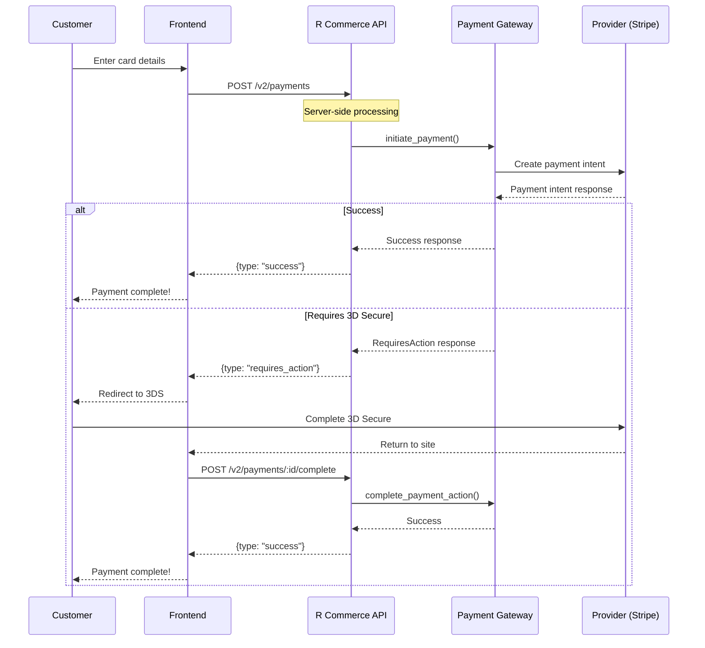

# Payment Gateways

R Commerce supports multiple payment gateways with a unified, server-side processing interface. This allows you to accept payments from customers worldwide without exposing API keys in your frontend code.

## Supported Gateways

| Gateway | Region | Features |
|---------|--------|----------|
| [Stripe](./stripe.md) | Global | Cards, wallets, subscriptions |
| [Airwallex](./airwallex.md) | Global | Multi-currency, FX optimization |
| [Alipay](./alipay.md) | China | QR payments, mobile wallets |
| [WeChat Pay](./wechatpay.md) | China | In-app payments, mini programs |

## Architecture Overview

The payment system uses a provider-agnostic trait that all gateways implement:

```rust
#[async_trait]
pub trait AgnosticPaymentGateway: Send + Sync {
    /// Get gateway configuration
    async fn get_config(&self) -> Result<GatewayConfig>;
    
    /// Initiate a payment (server-side processing)
    async fn initiate_payment(
        &self,
        request: InitiatePaymentRequest,
    ) -> Result<InitiatePaymentResponse>;
    
    /// Complete payment action (3DS, redirect)
    async fn complete_payment_action(
        &self,
        request: CompletePaymentActionRequest,
    ) -> Result<CompletePaymentActionResponse>;
    
    /// Get payment status
    async fn get_payment_status(&self, payment_id: &str) -> Result<PaymentStatus>;
    
    /// Refund a payment
    async fn refund_payment(&self, request: RefundRequest) -> Result<RefundResponse>;
    
    /// Handle webhooks
    async fn handle_webhook(
        &self,
        payload: &[u8],
        headers: &[(String, String)],
    ) -> Result<WebhookEvent>;
}
```

## Server-Side Processing Flow

Unlike traditional payment integrations where the frontend communicates directly with Stripe.js, R Commerce handles all payment processing server-side:

```
┌─────────────┐     ┌──────────────────┐     ┌──────────────┐     ┌─────────────┐
│   Frontend  │────▶│  R Commerce API  │────▶│   Gateway    │────▶│   Provider  │
│  (Browser)  │◀────│   (Axum Server)  │◀────│  (Stripe)    │◀────│  (Stripe)   │
└─────────────┘     └──────────────────┘     └──────────────┘     └─────────────┘
                           │
                    ┌──────┴──────┐
                    │   Unified   │
                    │   Agnostic  │
                    │  Interface  │
                    └─────────────┘
```

### Benefits

1. **Security**: API keys are never exposed in JavaScript
2. **Simplicity**: Frontend doesn't need provider SDKs (Stripe.js, etc.)
3. **Flexibility**: Same frontend code works for all gateways
4. **Control**: Server controls the entire payment flow
5. **Compliance**: Easier PCI compliance (no card data in browser)

## Configuration

Enable payment gateways in your configuration:

```toml
[payment]
default_gateway = "stripe"

[payment.stripe]
enabled = true
api_key = "${STRIPE_SECRET_KEY}"
webhook_secret = "${STRIPE_WEBHOOK_SECRET}"

[payment.airwallex]
enabled = true
client_id = "${AIRWALLEX_CLIENT_ID}"
api_key = "${AIRWALLEX_API_KEY}"
webhook_secret = "${AIRWALLEX_WEBHOOK_SECRET}"
```

## Payment Flow



## API Endpoints (v2)

### Get Available Payment Methods

```http
POST /api/v2/payments/methods
{
  "currency": "USD",
  "amount": "99.99"
}
```

### Initiate Payment

```http
POST /api/v2/payments
{
  "gateway_id": "stripe",
  "amount": "99.99",
  "currency": "USD",
  "payment_method": {
    "type": "card",
    "card": {
      "number": "4242424242424242",
      "exp_month": 12,
      "exp_year": 2025,
      "cvc": "123"
    }
  }
}
```

### Complete Payment Action

```http
POST /api/v2/payments/:id/complete
{
  "action_type": "three_d_secure",
  "action_data": { ... }
}
```

## Frontend Integration

### Traditional Approach (Old)

```javascript
import { loadStripe } from '@stripe/stripe-js';

const stripe = await loadStripe('pk_live_...');
const { client_secret } = await fetch('/api/v1/payments').then(r => r.json());
const result = await stripe.confirmCardPayment(client_secret, {
  payment_method: { card: cardElement }
});
```

### R Commerce Approach (New)

```javascript
// No Stripe.js required!
const result = await fetch('/api/v2/payments', {
  method: 'POST',
  headers: { 'Content-Type': 'application/json' },
  body: JSON.stringify({
    gateway_id: 'stripe',
    amount: '99.99',
    currency: 'USD',
    payment_method: {
      type: 'card',
      card: {
        number: '4242424242424242',
        exp_month: 12,
        exp_year: 2025,
        cvc: '123'
      }
    }
  })
});

const data = await result.json();

if (data.type === 'success') {
  // Payment complete
} else if (data.type === 'requires_action') {
  // Handle 3D Secure
  window.location.href = data.action_data.redirect_url;
}
```

## Security

- **API Keys**: Stored server-side only, never exposed to frontend
- **Webhook Signatures**: Verified for authenticity
- **PCI Compliance**: Card data is processed server-side, never stored
- **Idempotency**: Keys prevent duplicate charges

## Webhook Handling

Configure webhook endpoints in each gateway's dashboard:

```
https://your-api.com/api/v2/webhooks/{gateway}
```

Examples:
- Stripe: `https://api.yoursite.com/api/v2/webhooks/stripe`
- Airwallex: `https://api.yoursite.com/api/v2/webhooks/airwallex`

See [Webhooks](./webhooks.md) for event types and handling.

## Multi-Gateway Strategy

You can configure multiple gateways and route payments based on:

- **Currency**: Use Airwallex for multi-currency, Stripe for USD/EUR
- **Region**: Alipay/WeChat for China, Stripe for global
- **Payment Method**: Specific gateway for specific methods
- **Fallback**: Automatic failover if primary gateway fails

## Next Steps

- [Configure Stripe](./stripe.md)
- [Configure Airwallex](./airwallex.md)
- [Configure Alipay](./alipay.md)
- [Configure WeChat Pay](./wechatpay.md)
- [Webhook Integration](./webhooks.md)
