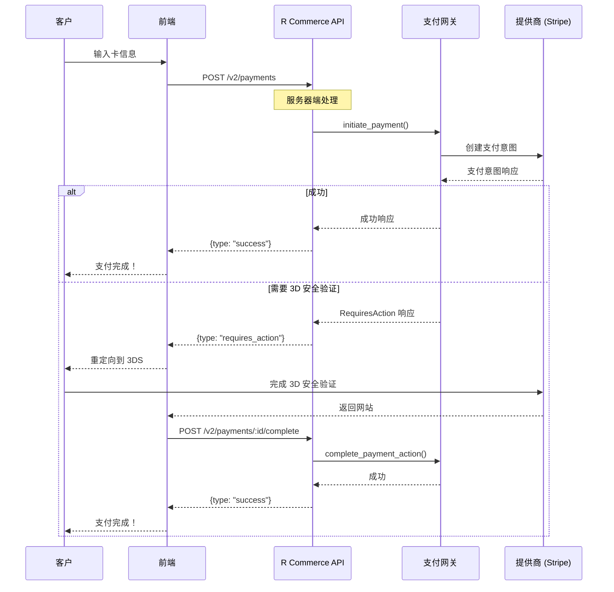

# 支付网关

R Commerce 支持多个支付网关，具有统一的服务器端处理接口。这使您能够接受来自全球客户的付款，而无需在前端代码中暴露 API 密钥。

## 支持的网关

| 网关 | 地区 | 功能 |
|---------|--------|----------|
| [Stripe](./stripe.md) | 全球 | 卡、钱包、订阅 |
| [Airwallex](./airwallex.md) | 全球 | 多币种、外汇优化 |
| [支付宝](./alipay.md) | 中国 | 二维码支付、移动钱包 |
| [微信支付](./wechatpay.md) | 中国 | 应用内支付、小程序 |

## 架构概览

支付系统使用一个提供商无关的 trait，所有网关都实现它：

```rust
#[async_trait]
pub trait AgnosticPaymentGateway: Send + Sync {
    /// 获取网关配置
    async fn get_config(&self) -> Result<GatewayConfig>;
    
    /// 发起支付（服务器端处理）
    async fn initiate_payment(
        &self,
        request: InitiatePaymentRequest,
    ) -> Result<InitiatePaymentResponse>;
    
    /// 完成支付操作（3DS、重定向）
    async fn complete_payment_action(
        &self,
        request: CompletePaymentActionRequest,
    ) -> Result<CompletePaymentActionResponse>;
    
    /// 获取支付状态
    async fn get_payment_status(&self, payment_id: &str) -> Result<PaymentStatus>;
    
    /// 退款
    async fn refund_payment(&self, request: RefundRequest) -> Result<RefundResponse>;
    
    /// 处理 webhooks
    async fn handle_webhook(
        &self,
        payload: &[u8],
        headers: &[(String, String)],
    ) -> Result<WebhookEvent>;
}
```

## 服务器端处理流程

与传统的支付集成不同，在传统集成中前端直接与 Stripe.js 通信，R Commerce 在服务器端处理所有支付：

```
┌─────────────┐     ┌──────────────────┐     ┌──────────────┐     ┌─────────────┐
│    前端     │────▶│  R Commerce API  │────▶│    网关      │────▶│    提供商    │
│  (浏览器)   │◀────│   (Axum 服务器)  │◀────│   (Stripe)   │◀────│   (Stripe)  │
└─────────────┘     └──────────────────┘     └──────────────┘     └─────────────┘
                           │
                    ┌──────┴──────┐
                    │    统一     │
                    │    通用     │
                    │    接口     │
                    └─────────────┘
```

### 优势

1. **安全性**：API 密钥永远不会暴露在 JavaScript 中
2. **简单性**：前端不需要提供商 SDK（Stripe.js 等）
3. **灵活性**：相同的前端代码适用于所有网关
4. **控制性**：服务器控制整个支付流程
5. **合规性**：更容易实现 PCI 合规（浏览器中没有卡数据）

## 配置

在配置中启用支付网关：

```toml
[payment]
default_gateway = "stripe"

[payment.stripe]
enabled = true
api_key = "${STRIPE_SECRET_KEY}"
webhook_secret = "${STRIPE_WEBHOOK_SECRET}"

[payment.airwallex]
enabled = true
client_id = "${AIRWALLEX_CLIENT_ID}"
api_key = "${AIRWALLEX_API_KEY}"
webhook_secret = "${AIRWALLEX_WEBHOOK_SECRET}"
```

## 支付流程



## API 端点

### 获取可用支付方式

```http
POST /api/v1/payments/methods
{
  "currency": "USD",
  "amount": "99.99"
}
```

### 发起支付

```http
POST /api/v1/payments
{
  "gateway_id": "stripe",
  "amount": "99.99",
  "currency": "USD",
  "payment_method": {
    "type": "card",
    "card": {
      "number": "4242424242424242",
      "exp_month": 12,
      "exp_year": 2025,
      "cvc": "123"
    }
  }
}
```

### 完成支付操作

```http
POST /api/v1/payments/:id/complete
{
  "action_type": "three_d_secure",
  "action_data": { ... }
}
```

## 前端集成

### 传统方式（旧版）

```javascript
import { loadStripe } from '@stripe/stripe-js';

const stripe = await loadStripe('pk_live_...');
const { client_secret } = await fetch('/api/v1/payments').then(r => r.json());
const result = await stripe.confirmCardPayment(client_secret, {
  payment_method: { card: cardElement }
});
```

### R Commerce 方式（新版）

```javascript
// 不需要 Stripe.js！
const result = await fetch('/api/v1/payments', {
  method: 'POST',
  headers: { 'Content-Type': 'application/json' },
  body: JSON.stringify({
    gateway_id: 'stripe',
    amount: '99.99',
    currency: 'USD',
    payment_method: {
      type: 'card',
      card: {
        number: '4242424242424242',
        exp_month: 12,
        exp_year: 2025,
        cvc: '123'
      }
    }
  })
});

const data = await result.json();

if (data.type === 'success') {
  // 支付完成
} else if (data.type === 'requires_action') {
  // 处理 3D 安全验证
  window.location.href = data.action_data.redirect_url;
}
```

## 安全

- **API 密钥**：仅存储在服务器端，从不暴露给前端
- **Webhook 签名**：验证真实性
- **PCI 合规性**：卡数据在服务器端处理，从不存储
- **幂等性**：密钥防止重复扣款

## Webhook 处理

在每个网关的仪表板中配置 webhook 端点：

```
https://your-api.com/api/v2/webhooks/{gateway}
```

示例：
- Stripe: `https://api.yoursite.com/api/v2/webhooks/stripe`
- Airwallex: `https://api.yoursite.com/api/v2/webhooks/airwallex`

请参阅 [Webhooks](./webhooks.md) 了解事件类型和处理。

## 多网关策略

您可以配置多个网关并根据以下条件路由支付：

- **币种**：使用 Airwallex 进行多币种，Stripe 进行 USD/EUR
- **地区**：中国使用支付宝/微信支付，全球使用 Stripe
- **支付方式**：特定网关用于特定方法
- **故障转移**：主网关故障时自动故障转移

## 下一步

- [配置 Stripe](./stripe.md)
- [配置 Airwallex](./airwallex.md)
- [配置支付宝](./alipay.md)
- [配置微信支付](./wechatpay.md)
- [Webhook 集成](./webhooks.md)
