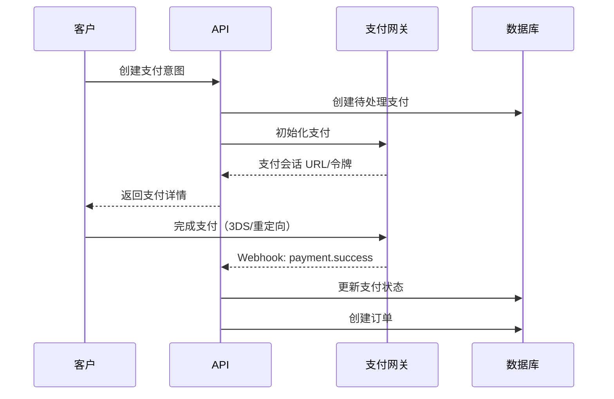

# 支付网关

R Commerce 支持多个支付网关，具有统一的接口，允许您接受来自全球客户的付款。

## 支持的网关

| 网关 | 地区 | 功能 |
|---------|--------|----------|
| [Stripe](./stripe.md) | 全球 | 卡、钱包、订阅 |
| [Airwallex](./airwallex.md) | 全球 | 多币种、外汇优化 |
| [支付宝](./alipay.md) | 中国 | 二维码支付、移动钱包 |
| [微信支付](./wechatpay.md) | 中国 | 应用内支付、小程序 |

## 架构概览

所有支付网关实现一个通用 trait：

```rust
#[async_trait]
pub trait PaymentGateway: Send + Sync {
    async fn create_payment(
        &self,
        request: CreatePaymentRequest,
    ) -> Result<PaymentResponse, PaymentError>;
    
    async fn capture_payment(
        &self,
        payment_id: &str,
    ) -> Result<PaymentResponse, PaymentError>;
    
    async fn refund_payment(
        &self,
        payment_id: &str,
        amount: Option<Decimal>,
    ) -> Result<RefundResponse, PaymentError>;
    
    async fn verify_webhook(
        &self,
        headers: &HeaderMap,
        body: &[u8],
    ) -> Result<WebhookEvent, PaymentError>;
}
```

## 配置

在配置中启用支付网关：

```toml
[payment]
default_gateway = "stripe"

[payment.stripe]
enabled = true
api_key = "${STRIPE_API_KEY}"
webhook_secret = "${STRIPE_WEBHOOK_SECRET}"

[payment.airwallex]
enabled = true
api_key = "${AIRWALLEX_API_KEY}"
client_id = "${AIRWALLEX_CLIENT_ID}"
```

## 支付流程



## 安全

- 所有 API 密钥存储为环境变量
- 验证 Webhook 签名以确保真实性
- 通过令牌化实现 PCI 合规（永不存储原始卡数据）
- 幂等键防止重复扣款

## Webhook 处理

在每个网关的仪表板中配置 webhook 端点：

```
https://your-api.com/api/v1/webhooks/payments/{gateway}
```

请参阅 [Webhooks](./webhooks.md) 了解事件类型和处理。

## 多网关策略

您可以配置多个网关并根据以下条件路由支付：

- **币种**: 使用 Airwallex 进行多币种，Stripe 进行 USD/EUR
- **地区**: 中国使用支付宝/微信支付，全球使用 Stripe
- **支付方式**: 特定网关用于特定方法
- **故障转移**: 主网关故障时自动故障转移

## 下一步

- [配置 Stripe](./stripe.md)
- [配置 Airwallex](./airwallex.md)
- [配置支付宝](./alipay.md)
- [配置微信支付](./wechatpay.md)
- [Webhook 集成](./webhooks.md)
